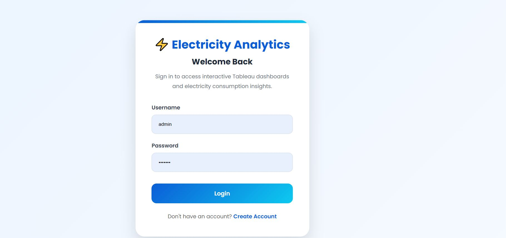
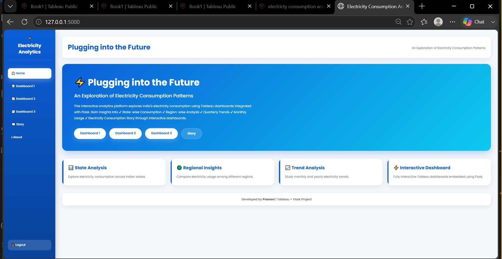
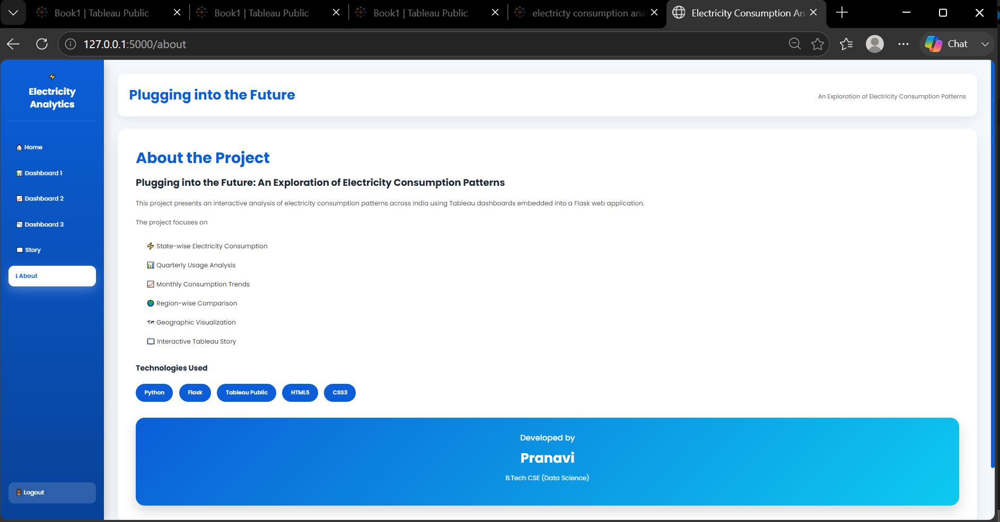

⚡ Plugging into the Future: An Exploration of Electricity Consumption Patterns

(Professional banner image here — optional)

Badges for Python, Flask, Tableau Public, SQLite, HTML5, CSS3, JavaScript, Render.

📖 Overview

A polished introduction describing the project, why electricity consumption analysis matters, the impact of COVID-19, and how the application combines Tableau dashboards with Flask to provide an interactive analytics experience.

🚀 Live Demo

Render Deployment

🔗 Coming Soon (Add your Render URL here after deployment)

🎥 Project Demonstration

Demo Video:

https://drive.google.com/file/d/1tybfY_tr-eqhafgXQzOGZsUPWW3Xjy32/view

📊 Project Preview
Login Page

Home Page

About Page

Dashboard 1

Dashboard 2

Dashboard 3

Tableau Story

🎯 Problem Statement

Use the SkillWallet description about electricity consumption, regional demand, COVID-19 lockdown effects, and recovery.

🎯 Objectives
Analyze state-wise electricity consumption.
Compare regional consumption.
Study monthly and quarterly trends.
Understand COVID-19 impact.
Build interactive dashboards.
Integrate Tableau into a Flask web application.
🏗️ System Architecture

This is where your architecture diagram goes.

Below it, explain the flow:

Raw Electricity Dataset
Data Preparation
Tableau Visualizations
Tableau Public Publishing
Flask Integration
User Authentication
Interactive Dashboard
Deployment on Render
🖥️ Website Architecture

A simple flow diagram in text:

Dataset
   │
   ▼
Data Cleaning
   │
   ▼
Tableau Dashboards
   │
   ▼
Tableau Public
   │
   ▼
Flask Backend
   │
   ▼
Authentication
   │
   ▼
Responsive Website
   │
   ▼
Render Deployment
📈 Features
Secure Login & Registration
Responsive UI
Interactive Tableau Dashboards
State-wise Analysis
Region-wise Analysis
Quarterly Trends
Monthly Trends
Story Visualization
SQLite Database
Flask Authentication
Render Ready
📊 Tableau Public

Dashboard 1

https://public.tableau.com/views/electrictyconsumptionanalysis/Dashboard1?...

Dashboard 2

https://public.tableau.com/views/electrictyconsumptionanalysis/Dashboard2?...

Dashboard 3

https://public.tableau.com/views/electrictyconsumptionanalysis/Dashboard3?...

Story

https://public.tableau.com/views/storyelectricityconsumption/StoryonElectricityConsumptioninIndia?...

🛠️ Tech Stack
Technology	Purpose
Python	Backend
Flask	Web Framework
Tableau Public	Visualization
SQLite	Database
HTML5	Frontend
CSS3	Styling
JavaScript	Interactivity
Render	Deployment
📂 Project Structure
Electricity_Consumption_Patterns
│
├── Assets
│   ├── login.png
│   ├── home.png
│   ├── about.png
│   ├── dashboard1.jpg
│   ├── dashboard2.jpg
│   ├── dashboard3.jpg
│   ├── story.jpg
│   └── architecture.png
│
├── Dataset
├── Documentation
├── demo_video
├── instance
├── static
├── templates
├── app.py
├── Procfile
├── requirements.txt
└── README.md
⚙️ Installation
git clone <your-repository-url>

cd Electricity_Consumption_Patterns

pip install -r requirements.txt

python app.py

Open:

http://127.0.0.1:5000
📌 Scenarios Covered
Scenario 1 – Overall Consumption Trends

Analysis of electricity usage from January 2019 to December 2020, highlighting seasonal changes and the impact of COVID-19.

Scenario 2 – Regional Variations

Comparison of electricity consumption across Northern, Southern, Eastern, Western, and Northeastern regions.

Scenario 3 – Recovery After Lockdown

Study of how different states recovered in electricity demand following nationwide COVID-19 restrictions.

👥 Team
Name	Role
Guruju Harika Durga Bhavani	Team Lead
Pranavi Karumuri	Developer
Kavala Naga Veera Manikanta	Member
Lahari Iddum	Member
Lakshmi Prasanna	Member
👩‍💻 Developed By

Pranavi Karumuri

B.Tech – Computer Science & Data Science

Swarnandhra College of Engineering and Technology

🔮 Future Scope
AI-based electricity demand forecasting
Machine learning consumption prediction
Live electricity APIs
Real-time analytics
Smart grid monitoring
Mobile-first responsive dashboard
Advanced business intelligence reports
📄 License

This project is intended for educational and academic purposes.